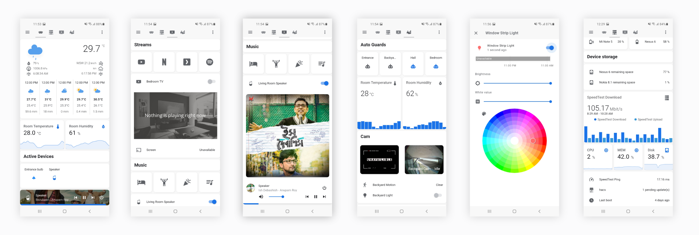

# HA - config.
  
[Home Assistant](https://www.home-assistant.io/) • [Esphome](https://esphome.io/) • [HACS](https://hacs.xyz/)
  

  


It's been a few months now that I am tinkering with Home assistant. With the vibrant community out there, 
it was easy to catch up. I have penned down my journey and experience while exploring home automation. 

[Home automation and why Home Assistant?](https://blog.tanay.co/home-automation-and-why-home-assistant/)

Special thanks to all the creators and contributors that we can easily configure a whole bunch of
integrations with simple configurations.

Opening up my config files. Star this repo / Follow me on [@twitter](https://twitter.com/tanaykumarbera) to get latest updates.

`* Few files and references might seem non-existent, since secrets are ignored.`

🍻
  
```
MIT License

Copyright (c) 2020 Tanay Kumar Bera

Permission is hereby granted, free of charge, to any person obtaining a copy
of this software and associated documentation files (the "Software"), to deal
in the Software without restriction, including without limitation the rights
to use, copy, modify, merge, publish, distribute, sublicense, and/or sell
copies of the Software, and to permit persons to whom the Software is
furnished to do so, subject to the following conditions:

The above copyright notice and this permission notice shall be included in all
copies or substantial portions of the Software.

THE SOFTWARE IS PROVIDED "AS IS", WITHOUT WARRANTY OF ANY KIND, EXPRESS OR
IMPLIED, INCLUDING BUT NOT LIMITED TO THE WARRANTIES OF MERCHANTABILITY,
FITNESS FOR A PARTICULAR PURPOSE AND NONINFRINGEMENT. IN NO EVENT SHALL THE
AUTHORS OR COPYRIGHT HOLDERS BE LIABLE FOR ANY CLAIM, DAMAGES OR OTHER
LIABILITY, WHETHER IN AN ACTION OF CONTRACT, TORT OR OTHERWISE, ARISING FROM,
OUT OF OR IN CONNECTION WITH THE SOFTWARE OR THE USE OR OTHER DEALINGS IN THE
SOFTWARE.

```
